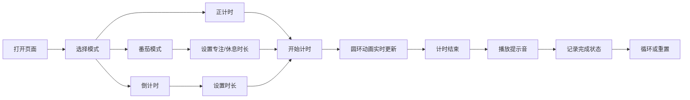

## 1. 产品概述

桌面番茄钟+多功能计时器，一款面向办公人士和学生的时间管理工具。采用简约商务风格设计，帮助用户高效管理时间、提升专注力。

- **核心价值**：结合番茄工作法与灵活计时功能，通过可视化进度和任务绑定，让时间管理更高效直观
- **目标用户**：办公白领、自由职业者、学生群体等需要专注工作/学习的人群
- **产品定位**：轻量级、高颜值、功能完备的桌面端时间管理工具

## 2. 核心功能

### 2.1 用户角色
无需注册登录，所有数据本地存储，面向所有需要时间管理的用户。

### 2.2 功能模块

1. **番茄模式**：专注25分钟+休息5分钟循环，支持自定义专注/休息时长
2. **正计时/倒计时**：手动设置时分秒，支持开始、暂停、重置操作
3. **铃声提醒**：计时结束播放提示音，支持音效开关
4. **进度圆环动画**：SVG圆环实时展示剩余时间比例，动画流畅
5. **任务清单**：绑定计时任务，记录完成状态，支持新增/删除/勾选
6. **本地存储**：保存常用时长配置、任务列表数据，刷新不丢失
7. **全屏模式**：页面全屏显示，专注计时，屏蔽干扰

### 2.3 页面详情
单页面应用，所有功能集成在同一页面。

| 页面名称 | 模块名称 | 功能描述 |
|-----------|-------------|---------------------|
| 主页面 | 模式切换栏 | 番茄模式/正计时/倒计时 三种模式Tab切换 |
| 主页面 | 计时器区域 | 进度圆环动画 + 时间数字显示 + 控制按钮 |
| 主页面 | 时长设置区 | 自定义番茄时长、计时时长输入 |
| 主页面 | 任务清单区 | 任务列表、新增输入框、完成状态管理 |
| 主页面 | 功能控制区 | 音效开关、全屏按钮 |

## 3. 核心流程

用户打开页面 → 选择计时模式 → 设置时长（可选）→ 添加任务（可选）→ 开始计时 → 进度实时更新 → 计时结束播放提示音 → 记录任务完成状态

## 4. 用户界面设计

### 4.1 设计风格
- **主色调**：深蓝商务色 `#1e3a5f`，搭配沉稳深灰 `#2c3e50`
- **辅助色**：专注模式用珊瑚红 `#e74c3c`，休息模式用薄荷绿 `#27ae60`，中性用暖金 `#f39c12`
- **背景**：高级深灰渐变 `#1a1a2e` → `#16213e`，营造专注氛围
- **按钮风格**：圆角矩形，微悬浮阴影，点击反馈过渡动画
- **字体**：主字体使用 `'Inter', 'PingFang SC', 'Microsoft YaHei'`，数字使用等宽字体 `'JetBrains Mono', monospace`
- **布局风格**：卡片式布局，清晰的视觉层次，充足留白
- **图标**：使用简洁线性图标，统一粗细风格

### 4.2 页面设计概览
| 页面名称 | 模块名称 | UI元素 |
|-----------|-------------|-------------|
| 主页面 | 模式切换 | 横向Tab，选中状态下划线+高亮 |
| 主页面 | 计时器 | 中心圆环SVG动画，数字居中显示，秒数微缩显 |
| 主页面 | 控制按钮 | 开始/暂停/重置 三个主要按钮，不同状态色 |
| 主页面 | 时长设置 | 数字输入框，带加减微调按钮 |
| 主页面 | 任务清单 | 列表项带复选框，hover显示删除按钮，完成项划线|
| 主页面 | 功能区 | 开关按钮，图标按钮，悬停提示 |

### 4.3 响应式
- 桌面端优先设计，最小宽度 768px
- 自适应窗口大小，计时器圆环尺寸随容器动态调整
- 移动端（<768px）自动调整布局，任务清单改为底部抽屉形式
