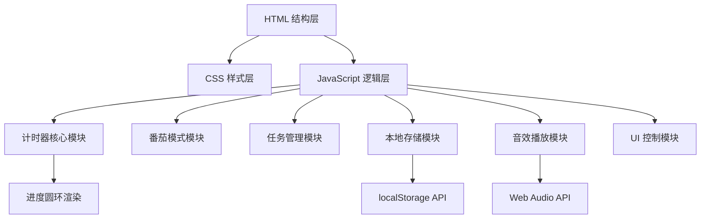

## 1. 架构设计

纯前端单页面应用，无后端服务，所有数据本地存储。



## 2. 技术描述

- **前端技术栈**：原生 HTML5 + CSS3 + JavaScript (ES6+)
- **初始化方式**：直接创建文件，无需构建工具
- **CSS 特性**：CSS 变量、Flex/Grid 布局、CSS Animation、SVG 动画
- **JS 特性**：模块化 IIFE、requestAnimationFrame、Web Audio API、localStorage
- **图标方案**：内联 SVG 图标，无需外部依赖
- **字体方案**：系统字体栈 + Google Fonts（可选降级）

## 3. 数据模型

### 3.1 本地存储数据结构

```javascript
// 存储在 localStorage 中
{
  // 番茄钟配置
  pomodoroConfig: {
    focusDuration: 25,      // 专注时长（分钟）
    shortBreakDuration: 5,  // 短休息时长（分钟）
    longBreakDuration: 15,  // 长休息时长（分钟）
    longBreakInterval: 4,   // 长休息间隔（几个番茄后）
    autoStartBreak: false,  // 自动开始休息
    autoStartFocus: false   // 自动开始专注
  },
  
  // 计时器配置
  timerConfig: {
    countdownHours: 0,
    countdownMinutes: 10,
    countdownSeconds: 0,
    soundEnabled: true
  },
  
  // 任务列表
  tasks: [
    { id: 'timestamp', text: '任务描述', completed: false, pomodoros: 2, createdAt: 'timestamp' }
  ],
  
  // 统计数据
  stats: {
    completedPomodoros: 0,
    totalFocusTime: 0,     // 总专注时长（秒）
    completedTasks: 0
  }
}
```

## 4. 核心模块说明

### 4.1 计时器核心模块 (`Timer`)
- 维护计时状态：空闲、运行、暂停、完成
- 使用 `setInterval` 或 `Date.now()` 差值计算，保证精度
- 每秒触发 tick 事件，通知 UI 更新
- 支持暂停、继续、重置操作

### 4.2 番茄模式模块 (`Pomodoro`)
- 状态机：专注 → 短休息 → 专注 → ... → 长休息
- 记录当前番茄数，判断何时进入长休息
- 自动切换下一个阶段（可配置）

### 4.3 进度圆环模块 (`ProgressRing`)
- SVG 实现，使用 `stroke-dasharray` 和 `stroke-dashoffset` 动画
- 根据剩余时间比例计算偏移量
- 支持不同模式显示不同颜色

### 4.4 任务管理模块 (`TaskManager`)
- 任务的增删改查操作
- 绑定当前计时任务
- 完成状态切换和统计

### 4.5 音效模块 (`SoundManager`)
- 使用 Web Audio API 生成提示音（无需音频文件）
- 支持开关控制
- 提供不同类型的提示音

### 4.6 本地存储模块 (`StorageManager`)
- 封装 localStorage 操作
- 自动保存配置变更
- 页面加载时恢复配置和数据
